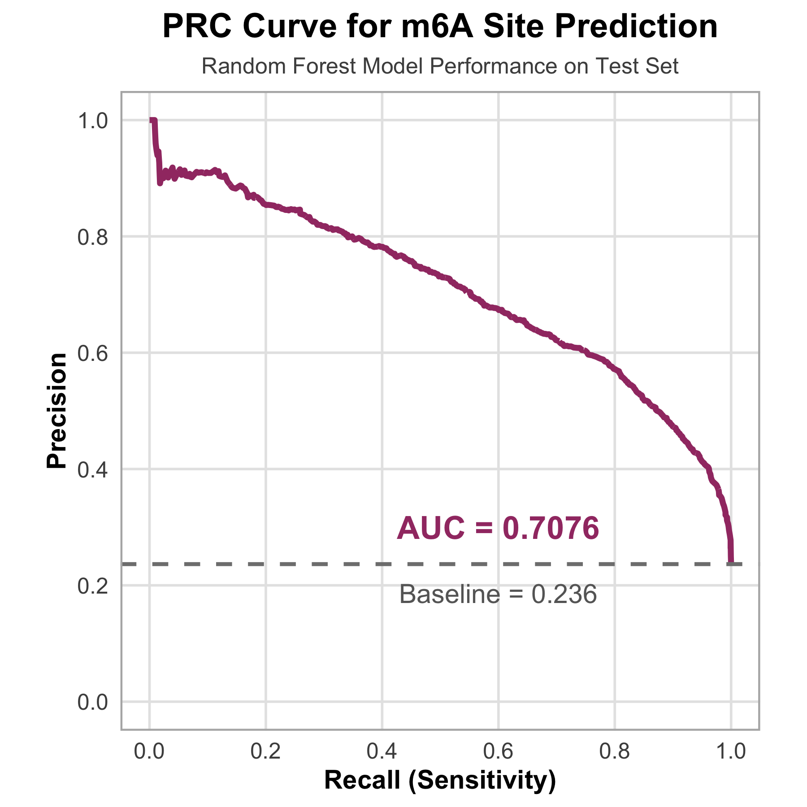

# m6APrediction

## Overview

`m6APrediction` is an R package designed to predict N6-methyladenosine (m6A) RNA modification sites using a pre-trained random forest model. The package provides user-friendly functions for both single-sample and batch predictions based on sequence and structural features.

m6A is one of the most abundant internal modifications in eukaryotic mRNA and plays critical roles in RNA metabolism, gene expression regulation, and various biological processes. This tool enables researchers to efficiently identify potential m6A sites in their RNA sequences of interest.

## Features

-   **Single Sample Prediction**: Predict m6A modification probability for individual RNA sites
-   **Batch Prediction**: Process multiple samples simultaneously for high-throughput analysis
-   **Pre-trained Model**: Uses a validated random forest model trained on experimental m6A data
-   **Feature-based Prediction**: Incorporates multiple sequence and structural features including:
    -   GC content
    -   RNA type (mRNA, lincRNA, lncRNA, pseudogene)
    -   RNA region (CDS, intron, 3'UTR, 5'UTR)
    -   Exon length
    -   Distance to splice junction
    -   Evolutionary conservation score
    -   5-nucleotide DNA sequence context

## Installation

You can install the development version of `m6APrediction` from GitHub using the `devtools` or `remotes` package:

``` r
# Install devtools if not already installed
install.packages("devtools")

# Install m6APrediction from GitHub
devtools::install_github("betheye/m6APrediction")
```

Or using `remotes`:

``` r
# Install remotes if not already installed
install.packages("remotes")

# Install m6APrediction from GitHub
remotes::install_github("betheye/m6APrediction")
```

## Quick Start

### Load the Package and Pre-trained Model

``` r
library(m6APrediction)

# Load the pre-trained random forest model
ml_fit <- readRDS(system.file("extdata", "rf_fit.rds", package = "m6APrediction"))
```

### Example 1: Single Sample Prediction

Predict m6A modification probability for a single RNA site:

``` r
# Make a prediction for a single sample
result <- prediction_single(
  ml_fit = ml_fit,
  gc_content = 0.6,
  RNA_type = "mRNA",
  RNA_region = "CDS",
  exon_length = 12,
  distance_to_junction = 5,
  evolutionary_conservation = 0.8,
  DNA_5mer = "ATCGA",
  positive_threshold = 0.5
)

# View the prediction result
print(result)
#  predicted_m6A_prob predicted_m6A_status 
#              "0.75"           "Positive"
```

### Example 2: Multiple Sample Prediction

Process multiple samples in batch:

``` r
# Load example input data
example_df <- read.csv(system.file("extdata", "m6A_input_example.csv",
                                    package = "m6APrediction"))

# Make predictions for multiple samples
predictions <- prediction_multiple(
  ml_fit = ml_fit,
  feature_df = example_df,
  positive_threshold = 0.6
)

# View the first few predictions
head(predictions)
```

### Customizing the Classification Threshold

You can adjust the probability threshold for classifying sites as positive:

``` r
# Use a more stringent threshold
predictions_stringent <- prediction_multiple(
  ml_fit = ml_fit,
  feature_df = example_df,
  positive_threshold = 0.7
)
```

## Model Performance

The random forest model demonstrates strong predictive performance on independent test data:

### ROC Curve


### Precision-Recall Curve



Key performance metrics:

\- **AUC-ROC**: 0.8871

\- **AUC-PRC**: 0.7076

\- **Accuracy**: 0.8389 (83.89%)

\- **Precision**: 0.7087 (70.87%)

\- **Sensitivity**: 0.5416 (54.16%)

\- **Specificity**: 0.9310 (93.10%)

\- **F1-Score**: 0.6140

## Input Data Format

### For `prediction_multiple()`

Your input data frame should contain the following columns:

| Column Name | Type | Description |
|------------------------|------------------------|------------------------|
| `gc_content` | Numeric | GC content of the sequence region (0-1) |
| `RNA_type` | Character | RNA type: "mRNA", "lincRNA", "lncRNA", or "pseudogene" |
| `RNA_region` | Character | RNA region: "CDS", "intron", "3'UTR", or "5'UTR" |
| `exon_length` | Numeric | Length of the exon |
| `distance_to_junction` | Numeric | Distance to the nearest splice junction |
| `evolutionary_conservation` | Numeric | Conservation score (0-1) |
| `DNA_5mer` | Character | 5-nucleotide DNA sequence (e.g., "ATCGA") |

### For `prediction_single()`

Provide each feature as individual function arguments (see examples above).

## Interactive Web Application

Try our **interactive Shiny web application** for easy exploration of m6A predictions without programming:

🔗 **[Launch m6A Prediction Web App](https://yihanzhou23.shinyapps.io/P6_2360960/)**

The web app provides:
- User-friendly interface for single and batch predictions
- Interactive visualization of prediction results
- No R programming knowledge required
- Immediate results without local installation

## Citation

If you use `m6APrediction` in your research, please cite:

```         
Zhou, Y. (2025). m6APrediction: An R Package for Predicting N6-Methyladenosine 
RNA Modification Sites. Available at: https://github.com/betheye/m6APrediction
```

## License

This package is licensed under the MIT License.

## Contact

For questions, suggestions, or bug reports, please contact:

\- **Yihan Zhou**: [Yihan.Zhou23\@student.xjtlu.edu.cn](mailto:Yihan.Zhou23@student.xjtlu.edu.cn){.email}

\- **GitHub Issues**: <https://github.com/betheye/m6APrediction/issues>

## Acknowledgments

This package was developed as part of the BIO215 Bioinformatics course at XJTLU. Special thanks to the course instructor for his guidance and support.
